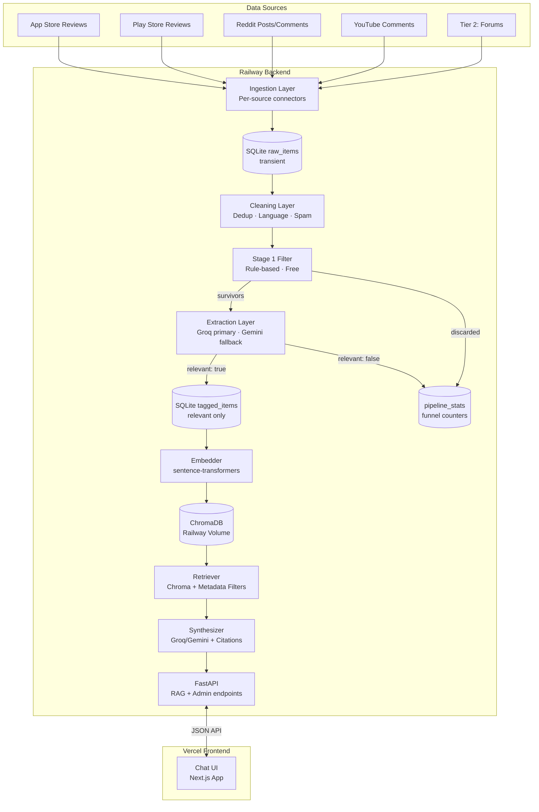

# Architecture: AI-Powered Discovery Engine

> Derived from [blinkit-discovery-engine-prd.md](file:///Users/shreyash/NextLeap/NL%20Grad%20Project/docs/blinkit-discovery-engine-prd.md) — this document translates the PRD into a concrete, buildable architecture.

---

## 1. System Overview

The Discovery Engine is a **batch-ingest, RAG-powered research tool** that transforms unstructured user feedback (app reviews, Reddit discussions, YouTube comments) into queryable, citation-backed insights about Blinkit user behavior.

### Core Design Principles

| Principle | Implication |
|---|---|
| **Full-stack cloud deployment** | Backend (FastAPI + pipeline + ChromaDB) on Railway; frontend (Next.js Chat UI) on Vercel |
| **Dual-LLM with fallback** | Groq (primary) and Gemini (fallback) — try Groq first, fall back to Gemini on rate-limit or error |
| **Aggressive data pruning** | Only `relevant: true` items are kept long-term. Irrelevant items are counted for funnel stats then purged to stay within free-tier storage limits |
| **Zero paid ingestion APIs** | Every source connector uses free/unauthenticated access only |

---

## 2. High-Level Architecture

```
┌─────────────────────────────────────────────────────────────────────────────────┐
│                       RAILWAY (backend + pipeline)                              │
│                                                                                 │
│  ┌──────────────────────────────────────────────────────────────────────────┐   │
│  │                        1. INGESTION LAYER                                │   │
│  │                                                                          │   │
│  │  ┌───────────┐ ┌───────────┐ ┌───────────┐ ┌───────────┐ ┌───────────┐ │   │
│  │  │ App Store  │ │Play Store │ │  Reddit   │ │  YouTube  │ │  Tier 2   │ │   │
│  │  │ Connector  │ │ Connector │ │ Connector │ │ Connector │ │Connectors │ │   │
│  │  │  (Tier 1)  │ │  (Tier 1) │ │  (Tier 1) │ │  (Tier 1) │ │(best-eff.)│ │   │
│  │  └─────┬─────┘ └─────┬─────┘ └─────┬─────┘ └─────┬─────┘ └─────┬─────┘ │   │
│  │        └──────────────┴──────────────┴──────────────┴──────────────┘      │   │
│  │                                  │                                        │   │
│  │                          ┌───────▼───────┐                                │   │
│  │                          │   Raw Store   │  (SQLite on Railway Volume)    │   │
│  │                          │  deduped by   │                                │   │
│  │                          │  post/item ID │                                │   │
│  │                          └───────┬───────┘                                │   │
│  └──────────────────────────────────┼────────────────────────────────────────┘   │
│                                     │                                            │
│  ┌──────────────────────────────────▼────────────────────────────────────────┐   │
│  │                        2. CLEANING LAYER                                  │   │
│  │   • Deduplication (content-hash + source-ID)                              │   │
│  │   • Language detection (langdetect / lingua)                              │   │
│  │   • Hinglish / code-mixed normalization + translation via deep-translator  │   │
│  │   • Spam / bot-pattern filter                                             │   │
│  └──────────────────────────────────┬────────────────────────────────────────┘   │
│                                     │                                            │
│  ┌──────────────────────────────────▼────────────────────────────────────────┐   │
│  │                     3. RELEVANCE FILTER (two-stage)                       │   │
│  │                                                                           │   │
│  │   Stage 1 — Rule-based (free, no LLM call)                               │   │
│  │   ┌─────────────────────────────────────────────────────────────────┐     │   │
│  │   │ • Drop items < 20-30 chars with no canonical category keyword  │     │   │
│  │   │ • Drop items matching ONLY app-technical vocab AND containing  │     │   │
│  │   │   no behavior-signal words                                     │     │   │
│  │   │ • Ambiguous items → pass through to Stage 2                    │     │   │
│  │   └──────────────────────────┬──────────────────────────────────────┘     │   │
│  │                              │                                            │   │
│  │   Stage 2 — LLM extraction (merged with Extraction Layer below)          │   │
│  │   • Batch Gemini call (fallback: Groq): tags + `relevant: true/false`    │   │
│  └──────────────────────────────┬────────────────────────────────────────────┘   │
│                                 │                                                │
│  ┌──────────────────────────────▼────────────────────────────────────────────┐   │
│  │                       4. EXTRACTION LAYER                                 │   │
│  │                                                                           │   │
│  │   • Batch LLM call (25 items/prompt) (Gemini primary, Groq fallback)      │   │
│  │   • Output: structured JSON array (taxonomy + relevant flag)              │   │
│  │   • Items tagged `relevant: false` → increment funnel counter, then purge │   │
│  │   • Items tagged `relevant: true` → persist to Tagged Store               │   │
│  └──────────────────────────────┬────────────────────────────────────────────┘   │
│                                 │                                                │
│  ┌──────────────────────────────▼────────────────────────────────────────────┐   │
│  │                       5. EMBEDDING & VECTOR STORE                         │   │
│  │                                                                           │   │
│  │   • Only `relevant: true` items are embedded                              │   │
│  │   • Embedding model: sentence-transformers (BAAI/bge-small-en-v1.5)      │   │
│  │   • Vector DB: ChromaDB (persistent mode, Railway Volume)                 │   │
│  │   • Metadata stored alongside vectors for filtered retrieval              │   │
│  └──────────────────────────────┬────────────────────────────────────────────┘   │
│                                 │                                                │
│  ┌──────────────────────────────▼────────────────────────────────────────────┐   │
│  │                       6. RAG CHAT LAYER (FastAPI)                         │   │
│  │                                                                           │   │
│  │   ┌────────────────┐    ┌────────────────┐    ┌───────────────────┐       │   │
│  │   │ Chroma DB      │───▶│  Retriever     │───▶│ LLM Synthesis     │       │   │
│  │   │ (from volume)  │    │ (semantic +    │    │ (Groq → Gemini    │       │   │
│  │   │                │    │  metadata      │    │  fallback)        │       │   │
│  │   │                │    │  filtering)    │    │                   │       │   │
│  │   └────────────────┘    └────────────────┘    └───────────────────┘       │   │
│  └──────────────────────────────────────────────────────────────────────────┘   │
│                                                                                 │
│  Railway Volume: /data/chroma/, /data/db.sqlite                                │
└────────────────────────────────────┬────────────────────────────────────────────┘
                                     │  JSON API
                                     ▼
┌─────────────────────────────────────────────────────────────────────────────────┐
│                            VERCEL (frontend)                                    │
│                                                                                 │
│  ┌──────────────────────────────────────────────────────────────────────────┐   │
│  │                          7. CHAT UI                                      │   │
│  │  • Natural-language question input                                      │   │
│  │  • Answers with inline citations (source, snippet, type)                │   │
│  │  • Per-source attribution                                               │   │
│  │  • Per-source volume transparency                                       │   │
│  │  • Insight summary generation (8 seed questions)                        │   │
│  └──────────────────────────────────────────────────────────────────────────┘   │
│                                                                                 │
└─────────────────────────────────────────────────────────────────────────────────┘
```

---

## 3. Data Models

### 3.1 Raw Item Schema (SQLite — `raw_items` table)

Every ingested item is normalized into this shape. Stored in SQLite on the Railway Volume for minimal footprint.

```json
{
  "id": "string — globally unique (source_prefix + native_id)",
  "source": "app_store | play_store | reddit | youtube | forum:<name>",
  "source_native_id": "string — the platform's own ID",
  "query_tags": ["blinkit", "quick-commerce"],
  "content_type": "review | post | comment",
  "title": "string | null",
  "body": "string — full text",
  "author": "string | null — public username only",
  "rating": "number | null",
  "timestamp": "ISO 8601",
  "url": "string | null — permalink",
  "parent_id": "string | null — for threaded comments",
  "language_detected": "string — ISO 639-1",
  "language_original": "string — raw text before translation",
  "ingested_at": "ISO 8601"
}
```

> **Storage note:** Raw items are transient. After extraction, items tagged `relevant: false` are deleted from this table. Only `relevant: true` items persist.

### 3.2 Tagged Item Schema (SQLite — `tagged_items` table)

Only items with `relevant: true` are stored here. Irrelevant items are counted and discarded.

```json
{
  "id": "string — same as raw item ID",
  "source": "string",
  "category_mentioned": ["Dairy & Bakery", "Electronics & Accessories"],
  "category_tier": ["core", "exploratory"],
  "behavior_type": "repeat-purchase | habit | one-time-try | abandoned-attempt | never-tried | null",
  "discovery_channel": "app home feed | search | ad | word-of-mouth | social media | other | null",
  "barrier_type": "trust/quality doubt | price anchoring | lack of info | delivery/logistics concern | no need perceived | other | null",
  "frustration": {
    "summary": "string | null",
    "severity": "low | med | high | null"
  },
  "unmet_need": "string | null",
  "segment_signal": "student | working professional | homemaker/family shopper | elderly/senior | not stated",
  "sentiment": "positive | neutral | negative",
  "source_snippet": "string — exact excerpt supporting the tags",
  "body": "string — full original text",
  "timestamp": "ISO 8601",
  "rating": "number | null",
  "url": "string | null",
  "extraction_model": "string — model used (groq/gemini)",
  "extracted_at": "ISO 8601"
}
```

### 3.3 Funnel Stats (SQLite — `pipeline_stats` table)

Tracks per-source, per-run counts for transparency reporting (FR12) without keeping the underlying data:

```json
{
  "run_id": "string (format: {run_id}_{source})",
  "source": "string",
  "run_timestamp": "ISO 8601",
  "raw_ingested": 1200,
  "stage1_passed": 950,
  "stage2_tagged": 950,
  "relevant_embedded": 720,
  "irrelevant_discarded": 230
}
```

### 3.4 Vector Store Document (ChromaDB)

Each embedded document in Chroma carries:

```
Document text:   source_snippet
Embedding:       sentence-transformer vector
Metadata:        {
                   id, source, category_mentioned, category_tier,
                   behavior_type, barrier_type, discovery_channel,
                   sentiment, segment_signal,
                   timestamp, rating, url
                 }
```

---

## 4. Component Detail

### 4.1 Ingestion Layer — Source Connectors

Each connector follows a common interface:

```python
class BaseConnector(ABC):
    @abstractmethod
    def fetch(self, config: ConnectorConfig) -> list[RawItem]:
        """Fetch items from the source. Idempotent — dedupes by native ID."""
        ...

    @abstractmethod
    def get_source_name(self) -> str: ...
```

| Connector | Library / Method | Dedup Key | Recency Window | Notes |
|---|---|---|---|---|
| `AppStoreConnector` | `app-store-scraper` / RSS feeds | `app_store:{review_id}` | 12-18 months | Free, no auth |
| `PlayStoreConnector` | `google-play-scraper` | `play_store:{review_id}` | 12-18 months | Free, no auth |
| `RedditConnector` | Arctic Shift (subreddit-scoped) + PullPush (Reddit-wide) — community-maintained Reddit data mirrors; no API key required. Consider using [BAScraper](https://github.com/maxjo020418/BAScraper) wrapper (async, wraps both services). | `reddit:{post_or_comment_id}` | 12-18 months | Single connector, two query sets, two upstream services with mutual fallback. Arctic Shift for subreddit-scoped queries (`/api/posts/search?subreddit=...&title=...&after=...`); PullPush for Reddit-wide text search. Both are volunteer-run with no uptime guarantee — see §14 risk table. |
| `YouTubeConnector` | YouTube Data API v3 (free quota) | `youtube:{comment_id}` | 12-18 months | Free quota; Blinkit-related videos/reviews |
| `ForumConnector` *(Tier 2)* | Per-forum scraping (BS4) | `forum:{forum_name}:{post_id}` | 12-18 months | Best-effort |

### 4.2 Cleaning Layer

Runs sequentially after ingestion:

1. **Deduplication** — content-hash (SHA-256 of normalized body) catches cross-source duplicates
2. **Language detection** — `langdetect` or `lingua-py`; stores `language_detected`
3. **Translation / normalization** — Hinglish and code-mixed text normalized via Groq/Gemini (batched); original preserved in `language_original`
4. **Spam filter** — heuristic rules: repetitive patterns, bot signatures, promotional links

### 4.3 Relevance Filter

Two stages, both running before embedding:

```
         All cleaned items
               │
       ┌───────▼───────┐
       │   Stage 1     │  Rule-based (free)
       │   (discard     │
       │   obvious      │
       │   noise)       │
       └───────┬───────┘
               │ survivors + ambiguous
       ┌───────▼───────┐
       │   Stage 2     │  = Extraction Layer call
       │   (LLM tags   │  (one call does taxonomy +
       │   + relevant   │   relevant flag)
       │   flag)        │
       └───────┬───────┘
               │
       ┌───────▼───────┐
       │  relevant:     │──── true ───▶ Store in tagged_items + Embed in ChromaDB
       │  true/false?   │
       │                │──── false ──▶ Increment funnel counter → DELETE raw data
       └───────────────┘
```

**Stage 1 rules:**

| Rule | Condition | Action |
|---|---|---|
| Too short, no signal | `len(body) < 25` AND no canonical category keyword present | Discard (skip Stage 2) |
| Pure technical complaint | Body matches ONLY app-technical vocab AND contains NO behavior-signal words | Discard |
| Delivery + category | Delivery complaint BUT tied to a category mention | **Pass through** — legitimate `barrier_type` signal |
| Everything else | Ambiguous | Pass through to Stage 2 |

### 4.4 Extraction Layer

A single LLM call per item handles both taxonomy tagging and relevance classification.

**LLM Strategy — Groq primary, Gemini fallback:**

```
         Item to extract
               │
       ┌───────▼───────┐
       │   Groq API    │  (Llama 3.3 70B or similar)
       │   try first   │
       └───────┬───────┘
               │
          success? ──── yes ───▶ return result
               │
              no (rate-limit / 5xx / timeout)
               │
       ┌───────▼───────┐
       │  Gemini API   │  (Gemini 2.0 Flash via Google AI Studio)
       │  fallback     │
       └───────┬───────┘
               │
          return result (or log failure after 3 retries)
```

**Prompt structure:**

```
System: You are a research analyst tagging user feedback about Blinkit / quick-commerce.
        Tag each item against this taxonomy: [Section 5 schema from PRD].
        Use ONLY the canonical category list: [list].
        Also determine: is this item relevant to understanding category discovery,
        user behavior, trust, or barriers? Set `relevant: true` or `relevant: false`.
        Return valid JSON.

User:   <item body>
```

**Cost controls:**
- Groq free tier: ~30 req/min, 14,400 req/day — sufficient for batch extraction
- Gemini free tier: 15 RPM / 1 million TPM — generous fallback
- Batched requests with concurrency limits respecting rate limits
- Dry-run gate: test on ~20-30 items per source before scaling

### 4.5 Embedding & Vector Store

| Aspect | Choice | Rationale |
|---|---|---|
| Embedding model | `BAAI/bge-small-en-v1.5` (sentence-transformers) | Fast, free, top semantic quality for short text |
| Vector DB | ChromaDB (persistent mode, Railway Volume) | Simple, file-based, survives redeploys |
| What gets embedded | `source_snippet` field (the excerpt, not full body) | Tighter semantic match |
| Metadata | All taxonomy tags + source info stored as Chroma metadata | Enables filtered retrieval at query time |

### 4.6 RAG Chat Layer (Railway — FastAPI)

```
User question (from Vercel frontend)
      │
      ▼
┌─────────────────────┐
│   Query Processing   │  • Rephrase for retrieval
│                     │  • Extract filter hints (category, source, etc.)
└──────────┬──────────┘
           │
           ▼
┌─────────────────────┐
│   Chroma Retrieval   │  • Semantic similarity search
│                     │  • Metadata filters (category_tier, etc.)
│                     │  • Top-k results (k=10-20)
└──────────┬──────────┘
           │
           ▼
┌─────────────────────┐
│   LLM Synthesis     │  • Groq primary, Gemini fallback
│                     │  • Generates answer from retrieved chunks
│                     │  • Inline citations [Source: Play Store, ★2, 2025-03]
│                     │  • Shows splits when evidence is contradictory
│                     │  • States sample sizes ("12 of 40 reviews mention...")
└──────────┬──────────┘
           │
           ▼
┌─────────────────────┐
│   Response Format    │  • Answer text with inline citations
│                     │  • Source breakdown (per-source counts)
└─────────────────────┘
```

**Synthesis prompt constraints (FR9, FR10, FR13):**
- Every factual claim must cite the specific source snippet, tagged with source name
- When evidence splits, present both sides with relative frequency
- Quantified claims must state sample size

### 4.7 Chat UI (Vercel — Next.js Frontend)

A standalone frontend deployed on Vercel, consuming the Railway FastAPI backend:

- **Data Ingestion Control Panel:** UI element with two buttons for triggering ingestion modes (`Demo` vs `Full Pipeline`) with live status feedback.
- **Input:** natural-language question text box
- **Output:** formatted answer with:
  - Inline citations linking to source snippets
  - Per-source volume indicators
- **Insight summary button:** triggers on-demand generation of answers to all 8 seed questions
- **Data transparency panel:** per-source funnel counts (raw → filtered → tagged → embedded)

---

## 5. Deployment Topology

```
┌──────────────────────────────────────┐        ┌───────────────────────────────┐
│             RAILWAY                   │        │           VERCEL              │
│         (backend + pipeline)          │        │         (frontend)            │
│                                       │        │                               │
│  ┌─────────────────────────────────┐ │  JSON  │  ┌───────────────────────┐   │
│  │  FastAPI Service                │ │◀──API──▶│  │     Next.js App       │   │
│  │                                 │ │        │  │                       │   │
│  │  • POST /api/chat               │ │        │  │  • Calls Railway API  │   │
│  │  • POST /api/summary            │ │        │  │  • Renders answers    │   │
│  │  • GET  /api/stats              │ │        │  │  • Shows citations    │   │
│  │  • POST /api/admin/ingest       │ │        │  │                       │   │
│  │                                 │ │        │  └───────────────────────┘   │
│  │  • Groq API (primary LLM)      │ │        │                               │
│  │  • Gemini API (fallback LLM)   │ │        │  Deployed via: `vercel`       │
│  └──────────────┬──────────────────┘ │        │  Framework: Next.js           │
│                 │                      │        └───────────────────────────────┘
│  ┌──────────────▼──────────────────┐ │
│  │     Railway Volume (/data)      │ │
│  │                                 │ │
│  │  • /data/db.sqlite              │ │
│  │    (tagged_items + funnel stats) │ │
│  │  • /data/chroma/                │ │
│  │    (ChromaDB persist dir)       │ │
│  └─────────────────────────────────┘ │
│                                       │
│  Env vars:                            │
│  • GROQ_API_KEY                       │
│  • GEMINI_API_KEY                     │
│  • ADMIN_SECRET (for ingest trigger)  │
│  • YOUTUBE_API_KEY                    │
│  (No Reddit credentials needed —      │
│   Arctic Shift + PullPush are keyless) │
│                                       │
└──────────────────────────────────────┘
```

**Why this split:**
1. **Railway (backend):** Handles compute-heavy work (scraping, LLM calls, vector DB). Persistent volume retains data across deploys.
2. **Vercel (frontend):** Next.js on Vercel provides a robust React framework, instant edge deploys, great developer experience, and zero-config hosting.

---

## 6. Data Lifecycle & Storage Strategy

Free-tier storage is limited. The pipeline aggressively prunes data at every stage:

```
Raw scraped items (transient)
     │
     ▼ after cleaning + extraction
     │
     ├── relevant: true  → Store in tagged_items (SQLite) + Embed in ChromaDB
     │                      (~2-3 KB per item including embedding)
     │
     └── relevant: false → Increment per-source counter in pipeline_stats → DELETE
                            (zero long-term storage cost)

Stage 1 discards → Increment counter → DELETE immediately (never reach LLM)
```

**Estimated storage at full volume:**

| Component | Items | Size Estimate |
|---|---|---|
| `tagged_items` (SQLite) | ~1,500 relevant items | ~5-10 MB |
| ChromaDB (embeddings + metadata) | ~1,500 vectors | ~35-50 MB |
| `pipeline_stats` (SQLite) | ~50 rows (per run, per source) | <1 MB |
| **Total** | | **~40-60 MB** |

This fits comfortably within Railway's free-tier volume limits.

---

## 7. Directory Structure

```
NL Grad Project/
├── docs/
│   ├── blinkit-discovery-engine-prd.md
│   └── architecture.md                    ← this file
│
├── backend/                                # Railway deployment
│   ├── src/
│   │   ├── connectors/                     # Ingestion Layer (Spec A1/A2)
│   │   │   ├── __init__.py
│   │   │   ├── base.py                     # BaseConnector ABC
│   │   │   ├── app_store.py
│   │   │   ├── play_store.py
│   │   │   ├── reddit.py
│   │   │   ├── youtube.py                  # Tier 1
│   │   │   └── forums.py                   # Tier 2
│   │   │
│   │   ├── pipeline/                       # Cleaning + Filter + Extraction (Spec B)
│   │   │   ├── __init__.py
│   │   │   ├── cleaner.py                  # Dedup, language detect, spam filter
│   │   │   ├── relevance_filter.py         # Stage 1 rule-based filter
│   │   │   ├── extractor.py                # LLM taxonomy extraction (Stage 2)
│   │   │   └── embedder.py                 # Sentence-transformer → Chroma
│   │   │
│   │   ├── rag/                            # RAG Chat Layer (Spec C)
│   │   │   ├── __init__.py
│   │   │   ├── retriever.py                # Chroma query + metadata filtering
│   │   │   ├── synthesizer.py              # LLM synthesis + citation formatting
│   │   │   └── chat.py                     # Chat orchestration
│   │   │
│   │   ├── api/                            # FastAPI app (Spec C, deployed)
│   │   │   ├── __init__.py
│   │   │   ├── main.py                     # FastAPI app, CORS, startup
│   │   │   ├── routes/
│   │   │   │   ├── chat.py                 # POST /api/chat
│   │   │   │   ├── summary.py              # POST /api/summary
│   │   │   │   ├── stats.py                # GET  /api/stats
│   │   │   │   └── admin.py                # POST /api/admin/ingest
│   │   │   └── models.py                   # Pydantic request/response schemas
│   │   │
│   │   ├── insights/                       # Insight Summary (Spec D)
│   │   │   ├── __init__.py
│   │   │   ├── generator.py                # Runs 8 seed questions through RAG
│   │   │   └── templates.py                # Seed question definitions
│   │   │
│   │   └── shared/                         # Shared utilities
│   │       ├── __init__.py
│   │       ├── config.py                   # Settings, API keys, paths
│   │       ├── llm.py                      # Groq/Gemini client with fallback logic
│   │       ├── db.py                       # SQLite connection + queries
│   │       ├── schemas.py                  # RawItem, TaggedItem Pydantic models
│   │       ├── taxonomy.py                 # Canonical category lists, enums
│   │       └── constants.py                # Behavior-signal words, tech-vocab lists
│   │
│   ├── scripts/
│   │   ├── run_pipeline.py                 # Orchestrates full pipeline
│   │   └── run_dry_run.py                  # Small-sample test (20-30 items/source)
│   │
│   ├── tests/
│   │   ├── test_connectors.py
│   │   ├── test_filter.py
│   │   ├── test_extractor.py
│   │   └── test_rag.py
│   │
│   ├── Dockerfile
│   ├── railway.toml
│   ├── requirements.txt
│   └── .env.example
│
├── frontend/                               # Vercel deployment
│   ├── src/
│   │   ├── app/
│   │   │   ├── layout.tsx
│   │   │   ├── page.tsx                    # Chat UI
│   │   │   └── globals.css
│   │   ├── components/
│   │   │   ├── ChatMessage.tsx
│   │   │   ├── CitationBadge.tsx
│   │   │   ├── FunnelStats.tsx
│   │   │   └── IngestionControl.tsx        # UI panel for triggering ingestion
│   ├── next.config.mjs
│   ├── tailwind.config.ts
│   ├── tsconfig.json
│   ├── package.json
│   └── vercel.json                         # Vercel config (if needed)
│
└── README.md
```

---

## 8. Technology Stack

| Layer | Technology | Version / Notes |
|---|---|---|
| Language | Python | 3.11+ |
| Web framework | FastAPI | + Uvicorn |
| LLM — primary | Groq API | Llama 3.3 70B (free tier: 30 RPM, 14,400 req/day) |
| LLM — fallback | Google Gemini API | Gemini 2.0 Flash (free tier: 15 RPM, 1M TPM) |
| Embedding | sentence-transformers (`BAAI/bge-small-en-v1.5`) | Free, local, ~133MB model |
| Vector DB | ChromaDB | Persistent mode on Railway Volume |
| Data store | SQLite | Lightweight, single-file, on Railway Volume |
| App Store scraping | `app-store-scraper` | npm package (subprocess or Python port) |
| Play Store scraping | `google-play-scraper` | Python package |
| Reddit data | Arctic Shift API + PullPush API | Free, keyless, community-maintained Reddit mirrors. Optional: [BAScraper](https://github.com/maxjo020418/BAScraper) async wrapper |
| Web scraping | BeautifulSoup4 + requests | For forum scraping (Tier 2) |
| YouTube API | `google-api-python-client` | Free quota (10,000 units/day) |
| Language detection | `langdetect` or `lingua-py` | Free, local |
| Data validation | Pydantic v2 | Schema enforcement |
| Backend deployment | Railway | Free tier; FastAPI + Volume |
| Frontend deployment | Vercel | Free tier; Next.js app |
| Frontend | Next.js, React, TailwindCSS | Hosted on Vercel |

---

## 9. Data Flow — End to End



---

## 10. API Contracts

### 10.1 `POST /api/chat`

**Request:**
```json
{
  "question": "Why do users repeatedly buy from the same categories?",
  "filters": {
    "category_tier": "core",
    "source": ["play_store", "reddit"]
  }
}
```

**Response:**
```json
{
  "answer": "Users repeatedly buy from core categories primarily due to...",
  "citations": [
    {
      "snippet": "I only use Blinkit for milk and bread, it's just habit now",
      "source": "play_store",
      "rating": 4,
      "timestamp": "2025-08-15",
      "url": "https://...",
      "category_mentioned": ["Dairy & Bakery"],
      "behavior_type": "habit"
    }
  ],
  "source_breakdown": {
    "play_store": { "cited": 5, "total_relevant": 342 },
    "reddit": { "cited": 3, "total_relevant": 128 }
  },
  "has_contradictory_evidence": false,
  "llm_used": "groq"
}
```

### 10.2 `POST /api/summary`

**Request:**
```json
{
  "questions": "all"
}
```

**Response:**
```json
{
  "summaries": [
    {
      "question": "Why do users repeatedly buy from the same categories?",
      "answer": "...",
      "citations": ["..."],
      "confidence": "high",
      "sample_size": 87
    }
  ],
  "source_funnel": {
    "play_store": { "raw": 1200, "filtered": 950, "tagged": 720, "discarded": 230 },
    "app_store": { "raw": 800, "filtered": 620, "tagged": 485, "discarded": 135 }
  },
  "emergent_themes": ["..."]
}
```

### 10.3 `GET /api/stats`

**Response:**
```json
{
  "per_source_funnel": {
    "play_store":  { "raw_ingested": 1200, "stage1_passed": 950, "relevant_embedded": 720, "discarded": 230 },
    "app_store":   { "raw_ingested": 800,  "stage1_passed": 620, "relevant_embedded": 485, "discarded": 135 },
    "reddit":      { "raw_ingested": 450,  "stage1_passed": 380, "relevant_embedded": 310, "discarded": 70  },
    "youtube":     { "raw_ingested": 300,  "stage1_passed": 200, "relevant_embedded": 120, "discarded": 80  }
  },
  "last_pipeline_run": "2026-07-19T08:30:00Z",
  "total_embedded": 1635,
  "storage_used_mb": 55
}
```

### 10.4 `POST /api/admin/ingest`

Triggers a pipeline run (either quick demo or full scale). Secured with a shared secret.

**Request:**
```json
{
  "mode": "demo",
  "sources": ["play_store", "app_store", "reddit", "youtube"]
}
```

**Headers:** `Authorization: Bearer <ADMIN_SECRET>`

**Response:**
```json
{
  "status": "started",
  "run_id": "run_20260719_0830",
  "message": "Pipeline started as background task"
}
```

### 10.5 `GET /api/admin/ingest/status`

Returns current status and progress for the active pipeline run, including persistent logs and start timestamp.

**Response:**
```json
{
  "status": "running",
  "run_id": "run_20260719_0830",
  "message": "Embedding items into ChromaDB...",
  "start_time": 1721389800.5,
  "logs": [
    {"time": "14:30:00", "text": "Fetching from play_store..."},
    {"time": "14:31:12", "text": "Filtering play_store items..."}
  ]
}
```

---

## 11. LLM Integration — Dual-Provider Strategy

### Groq (Primary)

| Property | Value |
|---|---|
| Model | `llama-3.3-70b-versatile` (or latest available) |
| Free tier limits | 30 RPM, 14,400 requests/day, 131,072 token context |
| Used for | Extraction, RAG synthesis, translation |
| SDK | `groq` Python package |

### Gemini (Fallback)

| Property | Value |
|---|---|
| Model | `gemini-2.0-flash` |
| Free tier limits | 15 RPM, 1,000,000 TPM, 1,500 RPD |
| Used for | Fallback when Groq is rate-limited or errors |
| SDK | `google-genai` Python package |

### Fallback Logic

```python
class LLMClient:
    """Tries Groq first, falls back to Gemini on failure."""

    async def complete(self, system: str, user: str) -> LLMResponse:
        try:
            return await self._groq_call(system, user)
        except (RateLimitError, ServerError, TimeoutError):
            logger.warning("Groq failed, falling back to Gemini")
            return await self._gemini_call(system, user)
```

The response object always includes `llm_used: "groq" | "gemini"` for transparency.

---

## 12. Key Design Decisions

### 12.1 Dual-LLM vs. Single-LLM Pipeline

**Decision:** Use Groq as the primary LLM with Gemini as fallback, for both extraction and synthesis.

**Rationale:** Both providers offer generous free tiers. Groq is extremely fast (inference on custom hardware), making it ideal for batch extraction. Gemini provides a safety net when Groq's rate limits are hit. This avoids any single point of failure and keeps the entire pipeline zero-cost.

### 12.2 SQLite vs. JSON Files for Storage

**Decision:** Use SQLite instead of JSON files.

**Rationale:** On a cloud volume, a single SQLite file is more space-efficient than per-source JSON files (no filesystem overhead per file, no duplication). It also enables efficient deletion of irrelevant items without rewriting entire files, and makes funnel queries trivial (`SELECT COUNT(*) FROM ... GROUP BY source`).

### 12.3 Aggressive Deletion vs. "Nothing Deleted"

**Decision:** Delete all `relevant: false` items after counting them for funnel stats.

**Rationale:** Railway's free-tier volume is limited. At scale, keeping ~40-50% of ingested items (the irrelevant ones) doubles storage for data that will never be queried. The funnel stats table preserves the counts needed for transparency reporting (FR12) without keeping the underlying text. If filter criteria need tuning later, re-run the pipeline — the source data still exists on the public platforms.

### 12.4 Embedding Source Snippet vs. Full Body

**Decision:** Embed the `source_snippet` field, not the full review body.

**Rationale:** Snippets are semantically tighter. A 500-word review may cover 3 topics, but the snippet captures the specific signal that was tagged. Full body is stored in `tagged_items` for context if needed during synthesis.

### 12.5 Railway + Vercel Split

**Decision:** Backend on Railway, frontend on Vercel (separate repos / deploy targets).

**Rationale:**

| Concern | Railway | Vercel |
|---|---|---|
| Strength | Persistent volumes, background tasks, Docker support | Global CDN, instant deploys, zero-config Next.js hosting |
| Used for | FastAPI + pipeline + ChromaDB + SQLite | Next.js Chat UI |
| Free tier | 500 hrs/month, 1GB volume | Unlimited static/Next.js deploys |

Splitting lets each service use the platform it's best suited for. Vercel is the premier platform for Next.js hosting.

---

## 13. Spec-to-Architecture Mapping

| Spec | PRD Section | Architecture Component | Directory |
|---|---|---|---|
| **Spec A1** — Core Ingestion | Day 1 | Ingestion Layer (§4.1) + Cleaning Layer (§4.2) | `backend/src/connectors/`, `backend/src/pipeline/cleaner.py` |
| **Spec B** — Extraction Pipeline | Day 1 | Relevance Filter (§4.3) + Extraction Layer (§4.4) + Embedder (§4.5) | `backend/src/pipeline/` |
| **Spec C** — RAG Chat Interface | Day 2 | RAG Chat Layer (§4.6) + Chat UI (§4.7) + API (§10) | `backend/src/rag/`, `backend/src/api/`, `frontend/` |
| **Spec D** — Insight Summary | Day 3 | Insight Summary Generator | `backend/src/insights/` |
| **Spec A2** — Tier 2 Ingestion | Day 3 (best-effort) | Additional connectors | `backend/src/connectors/forums.py` |

---

## 14. Error Handling & Resilience

| Failure Mode | Handling Strategy |
|---|---|
| Connector fails mid-scrape | Checkpoint after each page/batch; resume from last checkpoint on retry |
| Rate-limited by source | Exponential backoff with jitter; configurable delay per connector |
| Arctic Shift unreachable | Retry the query via PullPush; log which service was used |
| PullPush unreachable | Retry the query via Arctic Shift; log which service was used |
| Both Reddit mirrors unreachable | Log error; report `raw_ingested: 0` for Reddit in `pipeline_stats`; pipeline continues without Reddit data (FR12) |
| Reddit mirror returns stale data | Archive mirrors may lag on very recent posts (hours to days); accept coverage gap for the most recent threads and document it |
| Groq API error | Automatic fallback to Gemini; log which provider was used |
| Gemini API error (both providers down) | Retry with exponential backoff (max 3 retries); failed items logged and skipped, not pipeline-blocking |
| LLM error during RAG synthesis | Return error to user with "try again" prompt; no silent failure |
| Railway Volume full | Pipeline checks available space before starting; alert via `/api/stats` response |
| Tier 2 connector breaks | Drop it and document the gap — do not burn remaining timeline debugging |

---

## 15. Security & Privacy

- **No PII collection** beyond what's already public in reviews/comments
- **No user de-anonymization** attempts
- **API keys** stored as Railway environment variables, never in code
- **Admin endpoint** secured with `ADMIN_SECRET` bearer token
- **CORS** configured to allow only the Vercel frontend domain
- **Legal/ToS:** scraping is for personal research/case-study only — stated explicitly in README
- **Data retention:** only relevant items stored; irrelevant data is never persisted

---

## 16. Observability & Reporting

### Per-Source Funnel (FR12)

Every pipeline run produces a funnel report stored in `pipeline_stats`:

```
Source          │ Raw Ingested │ Stage 1 Pass │ Relevant (Embedded) │ Discarded
────────────────┼──────────────┼──────────────┼─────────────────────┼──────────
Play Store      │        1,200 │          950 │                 720 │       230
App Store       │          800 │          620 │                 485 │       135
Reddit          │          450 │          380 │                 310 │        70
YouTube         │          300 │          200 │                 120 │        80
────────────────┼──────────────┼──────────────┼─────────────────────┼──────────
TOTAL           │        2,750 │        2,150 │               1,635 │       515
```

### Pipeline Logs

- Per-connector timing and error counts
- LLM provider usage breakdown (Groq vs. Gemini calls)
- Filter discard reasons (aggregated counts per rule)
- Embedding batch timing
- Storage usage on Railway Volume
