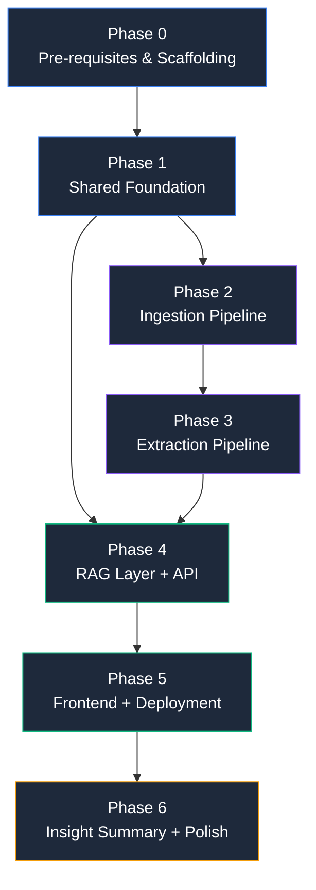

# Implementation Plan: AI-Powered Discovery Engine

> Derived from [architecture.md](file:///Users/shreyash/NextLeap/NL%20Grad%20Project/docs/architecture.md) and [blinkit-discovery-engine-prd.md](file:///Users/shreyash/NextLeap/NL%20Grad%20Project/docs/blinkit-discovery-engine-prd.md)

---

## Phase 0 — Pre-requisites & Scaffolding

> [!IMPORTANT]
> Complete before writing any application code. API registrations can have unpredictable delays.

### 0.1 API Credentials & Accounts

| Task | Details |
|---|---|
| ~~Register Reddit developer app~~ | **Not needed** — Reddit closed self-service developer registration. We use Arctic Shift + PullPush (keyless community mirrors) instead |
| Get YouTube Data API key | Enable YouTube Data API v3 in Google Cloud Console → create API key |
| Get Groq API key | [console.groq.com](https://console.groq.com) → free-tier key |
| Get Gemini API key | [aistudio.google.com](https://aistudio.google.com) → key for Gemini 2.0 Flash |
| Create Railway account | [railway.com](https://railway.com) → new project + persistent volume |
| Create Vercel account | [vercel.com](https://vercel.com) |
| Verify Arctic Shift + PullPush uptime | Check [Arctic Shift status](https://status.arctic-shift.photon-reddit.com) and test `https://api.pullpush.io/reddit/search/submission/?q=blinkit&size=1` — both are volunteer-run with no uptime guarantee |

### 0.2 Project Scaffolding

| Task | Details |
|---|---|
| Initialize `backend/` | Python project structure per [architecture.md §7](file:///Users/shreyash/NextLeap/NL%20Grad%20Project/docs/architecture.md#L462) — create all `__init__.py` files, empty module directories |
| `backend/requirements.txt` | `fastapi`, `uvicorn`, `bascraper`, `google-play-scraper`, `langdetect`, `chromadb`, `sentence-transformers`, `groq`, `google-genai`, `pydantic`, `beautifulsoup4`, `requests`, `aiohttp`, `google-api-python-client`, `numpy<2` |
| `backend/.env.example` | `GROQ_API_KEY`, `GEMINI_API_KEY`, `ADMIN_SECRET`, `YOUTUBE_API_KEY`, `DATA_DIR=/data` (no Reddit credentials needed — Arctic Shift and PullPush are keyless) |
| Initialize `frontend/` | `npx -y create-next-app@latest ./frontend` — TypeScript + TailwindCSS + App Router |
| `backend/Dockerfile` | Python 3.11 slim, pip install, uvicorn entrypoint |
| `backend/railway.toml` | Volume mount at `/data`, build/start commands |

### Exit Criteria
- [x] All 6 API keys/credentials obtained and tested
- [x] `backend/` and `frontend/` directories scaffolded
- [x] `pip install -r requirements.txt` succeeds
- [x] `frontend/` dev server starts with `npm run dev`

---

## Phase 1 — Shared Foundation

> [!NOTE]
> Every subsequent phase imports from `shared/`. This must be built and tested first.

### 1.1 Configuration

#### [NEW] [config.py](file:///Users/shreyash/NextLeap/NL%20Grad%20Project/backend/src/shared/config.py)
- Pydantic `BaseSettings` loading from environment / `.env`
- Paths: `DATA_DIR`, `CHROMA_DIR`, `SQLITE_PATH`
- API keys: `GROQ_API_KEY`, `GEMINI_API_KEY`, `ADMIN_SECRET`, `YOUTUBE_API_KEY`

### 1.2 Data Schemas

#### [NEW] [schemas.py](file:///Users/shreyash/NextLeap/NL%20Grad%20Project/backend/src/shared/schemas.py)
- `RawItem` model — [architecture.md §3.1](file:///Users/shreyash/NextLeap/NL%20Grad%20Project/docs/architecture.md#L120-L142)
- `TaggedItem` model — [architecture.md §3.2](file:///Users/shreyash/NextLeap/NL%20Grad%20Project/docs/architecture.md#L146-L174)
- `PipelineStats` model — [architecture.md §3.3](file:///Users/shreyash/NextLeap/NL%20Grad%20Project/docs/architecture.md#L176-L191)
- Enums: `SourceType`, `ContentType`, `BehaviorType`, `BarrierType`, `Sentiment`, `SegmentSignal`, `DiscoveryChannel`

### 1.3 Taxonomy & Constants

#### [NEW] [taxonomy.py](file:///Users/shreyash/NextLeap/NL%20Grad%20Project/backend/src/shared/taxonomy.py)
- `CORE_CATEGORIES` and `EXPLORATORY_CATEGORIES` as frozen sets from [PRD §5](file:///Users/shreyash/NextLeap/NL%20Grad%20Project/docs/blinkit-discovery-engine-prd.md#L78-L81)
- `classify_category_tier(category: str) -> "core" | "exploratory"`

#### [NEW] [constants.py](file:///Users/shreyash/NextLeap/NL%20Grad%20Project/backend/src/shared/constants.py)
- `BEHAVIOR_SIGNAL_WORDS`: try, first time, always order, compare, trust, quality, brand…
- `APP_TECHNICAL_VOCAB`: crash, lag, freeze, login, OTP, payment failure, bug…
- `CATEGORY_KEYWORDS`: flattened canonical names + common aliases ("milk" → Dairy & Bakery)

### 1.4 Database Layer

#### [NEW] [db.py](file:///Users/shreyash/NextLeap/NL%20Grad%20Project/backend/src/shared/db.py)
- `init_db()` → create tables: `raw_items`, `tagged_items`, `pipeline_stats`
- CRUD: `insert_raw_items()`, `insert_tagged_item()`, `delete_irrelevant_raw()`, `insert_pipeline_stats()`, `get_pipeline_stats()`, `get_tagged_items_count()`
- SQLite path from `config.SQLITE_PATH`

### 1.5 LLM Client

#### [NEW] [llm.py](file:///Users/shreyash/NextLeap/NL%20Grad%20Project/backend/src/shared/llm.py)
- `LLMClient` — Groq-primary, Gemini-fallback per [architecture.md §11](file:///Users/shreyash/NextLeap/NL%20Grad%20Project/docs/architecture.md#L737-L771)
- `async complete(system: str, user: str) -> LLMResponse`
- `LLMResponse`: `content`, `llm_used`, `tokens_used`
- Exponential backoff on rate-limit errors
- Logging of which provider handled each call

### Exit Criteria
- [x] `config.py` loads env vars successfully
- [x] `schemas.py` models can serialize/deserialize sample data
- [x] `db.py` creates SQLite tables and round-trips a test row
- [x] `llm.py` makes a test call to Groq and falls back to Gemini on simulated failure

---

## Phase 2 — Ingestion Pipeline (Spec A1)

Build all Tier 1 connectors following the `BaseConnector` interface from [architecture.md §4.1](file:///Users/shreyash/NextLeap/NL%20Grad%20Project/docs/architecture.md#L212-L233), plus the cleaning layer.

### 2.1 Base Connector

#### [NEW] [base.py](file:///Users/shreyash/NextLeap/NL%20Grad%20Project/backend/src/connectors/base.py)
- `BaseConnector(ABC)` with methods: `fetch(config) -> list[RawItem]`, `get_source_name() -> str`
- Shared retry/backoff decorator

### 2.2 Play Store Connector

#### [NEW] [play_store.py](file:///Users/shreyash/NextLeap/NL%20Grad%20Project/backend/src/connectors/play_store.py)
- Library: `google-play-scraper`
- App ID: `com.grofers.customerapp`
- Dedup key: `play_store:{review_id}`
- Filters to last 12-18 months
- Maps each review to `RawItem`

### 2.3 App Store Connector

#### [NEW] [app_store.py](file:///Users/shreyash/NextLeap/NL%20Grad%20Project/backend/src/connectors/app_store.py)
- Library: `app-store-scraper` (npm subprocess) or Python alternative
- Dedup key: `app_store:{review_id}`
- Filters to last 12-18 months

> [!WARNING]
> `app-store-scraper` is npm-based. Decide between subprocess invocation or a pure Python alternative — test which approach works during this phase.

### 2.4 Reddit Connector

#### [NEW] [reddit.py](file:///Users/shreyash/NextLeap/NL%20Grad%20Project/backend/src/connectors/reddit.py)
- **Libraries:** [BAScraper](https://github.com/maxjo020418/BAScraper) (async Python wrapper over Arctic Shift + PullPush) — evaluate first; fall back to raw `aiohttp` calls if BAScraper doesn't fit
- **No API key or registration required** — both services are keyless community-maintained Reddit mirrors

**Query routing (two upstream services):**

| Query Type | Service | API Endpoint | Rationale |
|---|---|---|---|
| Subreddit-scoped (branded) | **Arctic Shift** (primary) | `GET /api/posts/search?subreddit={sub}&title={query}&after={date}&limit=100` | Supports per-subreddit full-text search; generous rate limits (~120K req/hr) |
| Reddit-wide (broadened) | **PullPush** (primary) | `GET /reddit/search/submission/?q={query}&after={epoch}&size=100` | Supports Reddit-wide text search, which Arctic Shift does not |

**Fallback is mandatory:** if Arctic Shift errors/times out on a subreddit-scoped query → retry via PullPush, and vice versa. Never proceed with a single-service path.

- **Single connector, two query sets (FR2):**
  - Blinkit-branded (subreddit-scoped via Arctic Shift): `"blinkit"`, `"blinkit app"`, `"blinkit delivery"` across `r/india`, `r/bangalore`, `r/mumbai`, `r/IndianFood`, etc.
  - Broadened (Reddit-wide via PullPush): `"quick commerce india"`, `"zepto vs blinkit"`, `"instamart vs blinkit"`
- Dedup key: `reddit:{post_or_comment_id}` — posts matching both query sets stored once with merged `query_tags`
- Recency window: `after` parameter set to ~12-18 months ago (both services support date filtering)
- Fetches posts + comments (Arctic Shift: `/api/comments/search?link_id={post_id}`; PullPush: `/reddit/search/comment/?link_id={post_id}`)

> [!WARNING]
> Both Arctic Shift and PullPush are volunteer-maintained with no uptime guarantee. Arctic Shift may lag on very recent posts (archive mirrors, not live Reddit). Verify uptime via [Arctic Shift status page](https://status.arctic-shift.photon-reddit.com) before each pipeline run.

### 2.5 YouTube Connector

#### [NEW] [youtube.py](file:///Users/shreyash/NextLeap/NL%20Grad%20Project/backend/src/connectors/youtube.py)
- Library: `google-api-python-client` (YouTube Data API v3)
- Searches for Blinkit-related videos (reviews, comparisons, delivery)
- Fetches comment threads on matching videos
- Dedup key: `youtube:{comment_id}`
- Respects 10,000 units/day quota

### 2.6 Cleaning Layer

#### [NEW] [cleaner.py](file:///Users/shreyash/NextLeap/NL%20Grad%20Project/backend/src/pipeline/cleaner.py)
Per [architecture.md §4.2](file:///Users/shreyash/NextLeap/NL%20Grad%20Project/docs/architecture.md#L235-L242):

| Step | Function | Details |
|---|---|---|
| Dedup | `deduplicate(items)` | SHA-256 of normalized body; drop cross-source dupes |
| Language | `detect_language(item)` | `langdetect` → sets `language_detected`, preserves original |
| Translate | `translate_if_needed(item)` | Hinglish/code-mixed → translate via `deep-translator` (Google Translate); zero LLM cost |
| Spam | `filter_spam(items)` | Drop bot signatures, promo links, repetitive patterns |

### Exit Criteria
- [x] Each connector fetches ≥20 items from its source successfully
- [x] `RawItem` schema validates for all connector outputs
- [x] Dedup correctly catches a synthetically duplicated item
- [x] Language detection identifies at least one non-English item
- [x] Spam filter drops a synthetic promo-link item

---

## Phase 3 — Extraction Pipeline (Spec B)

Relevance filtering, LLM taxonomy extraction, embedding, and the full pipeline orchestrator.

### 3.1 Relevance Filter (Stage 1)

#### [NEW] [relevance_filter.py](file:///Users/shreyash/NextLeap/NL%20Grad%20Project/backend/src/pipeline/relevance_filter.py)
Per [architecture.md §4.3](file:///Users/shreyash/NextLeap/NL%20Grad%20Project/docs/architecture.md#L244-L279):

- `apply_stage1_filter(items) -> (survivors: list, discard_count: int)`
- Rules:
  1. Absolute Junk & Spam: Drop emojis, len < 5, and social/B2B spam ("subscribe", "hiring", etc.).
  2. Technical Noise: Drop items with app-technical vocab ("crash", "otp") AND no behavior/trust signals.
  3. Short-Text Trap: Drop `len(body) < 25` UNLESS it contains a Canonical Category or Pain/Behavior Keyword.
  4. Ambiguity Pass-Through: Pass everything else >25 chars to the LLM (let LLM return `relevant: false`).

### 3.2 LLM Extraction (Stage 2)

#### [NEW] [extractor.py](file:///Users/shreyash/NextLeap/NL%20Grad%20Project/backend/src/pipeline/extractor.py)
Per [architecture.md §4.4](file:///Users/shreyash/NextLeap/NL%20Grad%20Project/docs/architecture.md#L281-L324):

- `async process_batch(batch, llm) -> list[TaggedItem]`
  - Gemini 2.0 Flash as **primary LLM** (1,000,000 TPM limit perfectly suits batching). Groq is fallback.
  - Bundles 25 items into a single JSON array per prompt to avoid daily request limits.
  - Returns `None` for items LLM deems `relevant: false` (increments funnel counter).
- `async extract_all(items, llm) -> list[TaggedItem]`
  - Runs batches of 25 items with an explicit 4-second delay (`asyncio.sleep`) to strictly obey Gemini's 15 RPM limit.
  - Outputs perfectly structured list of `TaggedItem` Pydantic models.

### 3.3 Embedding

#### [NEW] [embedder.py](file:///Users/shreyash/NextLeap/NL%20Grad%20Project/backend/src/pipeline/embedder.py)
Per [architecture.md §4.5](file:///Users/shreyash/NextLeap/NL%20Grad%20Project/docs/architecture.md#L326-L333):

- `embed_and_store(items: list[TaggedItem], chroma_client) -> int`
- Loads `BAAI/bge-small-en-v1.5`
- Embeds `source_snippet` field (not full body)
- Stores in ChromaDB with all taxonomy metadata
- Returns count embedded

### 3.4 Pipeline Orchestrator

#### [NEW] [run_pipeline.py](file:///Users/shreyash/NextLeap/NL%20Grad%20Project/backend/scripts/run_pipeline.py)

```
1. For each source in config:
   a. connector.fetch() → raw items
   b. Insert into raw_items table
2. cleaner.deduplicate()
3. cleaner.detect_language()
4. cleaner.translate_if_needed()
5. cleaner.filter_spam()
6. relevance_filter.apply_stage1_filter() → survivors + stage1_discards
7. extractor.extract_batch(survivors) → tagged items (relevant only)
8. embedder.embed_and_store(tagged_items) → embed count
9. Insert pipeline_stats row per source
10. Delete irrelevant raw items
```

#### [NEW] [run_dry_run.py](file:///Users/shreyash/NextLeap/NL%20Grad%20Project/backend/scripts/run_dry_run.py)
- Same pipeline, limited to ~20-30 items per source
- Prints tagged output for manual inspection
- **This is the critical quality gate** — fix taxonomy/prompt issues before scaling

### 3.5 Dry-Run Quality Gate

> [!IMPORTANT]
> Do NOT scale to full volume until all checks pass:

- [x] Canonical categories firing correctly ("milk" → "Dairy & Bakery", not free-text)
- [x] `relevant: true/false` making sensible decisions
- [x] Delivery complaints with category mentions are kept (not filtered)
- [x] JSON output is valid and parseable by Pydantic
- [x] Groq primary / Gemini fallback working
- [x] Cross-source deduplication catching duplicates
- [x] Sample of *discarded* items reviewed — filter isn't cutting real signal

### Exit Criteria
- [x] Dry-run passes all 7 checks above
- [x] Full-scale pipeline runs successfully (500-1000 items/source)
- [x] `pipeline_stats` table has accurate funnel counts per source
- [x] ChromaDB contains ~1,500+ embedded items
- [x] Irrelevant raw items have been purged from SQLite

---

## Phase 4 — RAG Layer + API (Spec C)

### 4.1 Retriever

#### [NEW] [retriever.py](file:///Users/shreyash/NextLeap/NL%20Grad%20Project/backend/src/rag/retriever.py)
Per [architecture.md §4.6](file:///Users/shreyash/NextLeap/NL%20Grad%20Project/docs/architecture.md#L335-L366):

- `retrieve(question, filters, k=15) -> list[RetrievedItem]`
- Query processing: extract filter hints from natural-language question (category, source, sentiment)
- Semantic similarity search via ChromaDB
- Metadata filtering on: `category_tier`, `source`, `sentiment`, etc.
- Returns top-k with metadata + similarity scores

### 4.2 Synthesizer

#### [NEW] [synthesizer.py](file:///Users/shreyash/NextLeap/NL%20Grad%20Project/backend/src/rag/synthesizer.py)
- `async synthesize(question, retrieved, llm) -> SynthesisResult`
- Builds synthesis prompt with retrieved chunks injected as context
- Prompt constraints (FR9, FR10, FR13):
  - Every claim cites a specific snippet + source name
  - Contradictory evidence → present both sides with frequency
  - Quantified claims → state sample size
- Returns: answer, citations, source breakdown, `llm_used`

### 4.3 Chat Orchestrator

#### [NEW] [chat.py](file:///Users/shreyash/NextLeap/NL%20Grad%20Project/backend/src/rag/chat.py)
- `async chat(question, filters) -> ChatResponse`
- Orchestrates: retriever → synthesizer → response formatting
- Maps to API schema in [architecture.md §10.1](file:///Users/shreyash/NextLeap/NL%20Grad%20Project/docs/architecture.md#L629-L663)

### 4.4 FastAPI Application

#### [NEW] [main.py](file:///Users/shreyash/NextLeap/NL%20Grad%20Project/backend/src/api/main.py)
- FastAPI app with CORS middleware (Vercel domain)
- Startup: init SQLite, load ChromaDB, load embedding model
- Mount route modules

#### [NEW] [models.py](file:///Users/shreyash/NextLeap/NL%20Grad%20Project/backend/src/api/models.py)
- Request/response Pydantic models for all endpoints per [architecture.md §10](file:///Users/shreyash/NextLeap/NL%20Grad%20Project/docs/architecture.md#L627-L733)
- `ChatRequest`, `ChatResponse`, `SummaryRequest`, `SummaryResponse`, `StatsResponse`, `IngestRequest`, `IngestResponse`

#### [NEW] [routes/chat.py](file:///Users/shreyash/NextLeap/NL%20Grad%20Project/backend/src/api/routes/chat.py)
- `POST /api/chat` — question + optional filters → synthesized answer with citations

#### [NEW] [routes/stats.py](file:///Users/shreyash/NextLeap/NL%20Grad%20Project/backend/src/api/routes/stats.py)
- `GET /api/stats` — per-source funnel from `pipeline_stats` table

#### [NEW] [routes/admin.py](file:///Users/shreyash/NextLeap/NL%20Grad%20Project/backend/src/api/routes/admin.py)
- `POST /api/admin/ingest` — secured with `ADMIN_SECRET` bearer token
- Accepts payload `{"mode": "demo" | "full"}` to control ingestion volume (fast demo vs complete dataset)
- Triggers pipeline as background task
- Returns `run_id` + status
- `GET /api/admin/ingest/status` — returns current job status and progress

### Exit Criteria
- [x] `POST /api/chat` returns a valid answer with citations for a test question
- [x] `GET /api/stats` returns accurate funnel numbers
- [x] `POST /api/admin/ingest` triggers pipeline and returns `run_id`
- [ ] Retrieval returns topically relevant results (manual spot-check of 5 queries)
- [ ] Synthesis cites specific snippets with source names

---

## Phase 5 — Frontend + Deployment (Spec C cont.)

### 5.1 Next.js Chat UI

#### [NEW] [layout.tsx](file:///Users/shreyash/NextLeap/NL%20Grad%20Project/frontend/src/app/layout.tsx)
- Root layout: Google Font (Inter/Outfit), dark theme, meta tags (title, description)

#### [NEW] [page.tsx](file:///Users/shreyash/NextLeap/NL%20Grad%20Project/frontend/src/app/page.tsx)
- Main chat page:
  - Embeds `IngestionControl` into top navigation or actionable dashboard banner
  - Question input (text area + send button)
  - Answer display with formatted citations
  - Per-source breakdown badges
  - Loading skeleton animations

#### [NEW] [IngestionControl.tsx](file:///Users/shreyash/NextLeap/NL%20Grad%20Project/frontend/src/components/IngestionControl.tsx)
- Premium UI panel for Data Ingestion with two mode buttons:
  - 🚀 **Quick Demo Run**: Fetches a small sample (25 items per source) for fast testing
  - ⚡ **Full Pipeline Run**: Complete dataset ingestion
- Live status badge, progress indicator bar, and completed metrics
- Disables triggers while ingestion is active and displays toast/status feedback

#### [NEW] [ChatMessage.tsx](file:///Users/shreyash/NextLeap/NL%20Grad%20Project/frontend/src/components/ChatMessage.tsx)
- Renders a single Q&A pair
- Answer text with inline citation references
- Expandable citation cards

#### [NEW] [CitationBadge.tsx](file:///Users/shreyash/NextLeap/NL%20Grad%20Project/frontend/src/components/CitationBadge.tsx)
- Visual badge: source name, rating stars, timestamp
- Links to source URL when available

#### [NEW] [FunnelStats.tsx](file:///Users/shreyash/NextLeap/NL%20Grad%20Project/frontend/src/components/FunnelStats.tsx)
- Calls `GET /api/stats`
- Renders per-source funnel table (raw → filtered → embedded)

#### [NEW] [api.ts](file:///Users/shreyash/NextLeap/NL%20Grad%20Project/frontend/src/lib/api.ts)
- API client: `fetchChat()`, `fetchSummary()`, `fetchStats()`
- Base URL via `NEXT_PUBLIC_API_URL` env var → Railway backend

### 5.2 Railway Deployment (Backend)

1. Push `backend/` to Railway
2. Attach persistent volume mounted at `/data`
3. Set env vars: `GROQ_API_KEY`, `GEMINI_API_KEY`, `ADMIN_SECRET`, `YOUTUBE_API_KEY`
4. Verify: `curl https://<railway-url>/api/stats` returns valid JSON

### 5.3 Vercel Deployment (Frontend)

1. Push `frontend/` to Vercel
2. Set env var: `NEXT_PUBLIC_API_URL=https://<railway-url>`
3. Verify: frontend loads, chat connects to Railway backend

### 5.4 End-to-End Validation

- [x] Trigger ingest via `POST /api/admin/ingest` (dry-run first, then full)
- [ ] Full pipeline runs on Railway with persistent volume
- [ ] Ask all 8 seed questions through the chat UI on Vercel
- [ ] Citations are correct and link to real sources
- [x] `/api/stats` shows accurate funnel numbers

### Exit Criteria
- [ ] Chat UI is live on Vercel and fully functional
- [ ] Backend is live on Railway with data persisted on volume
- [ ] All 8 seed questions answerable with ≥3 cited examples each
- [ ] Frontend ↔ Backend communication works over HTTPS

---

## Phase 6 — Insight Summary + Polish (Spec D + Spec A2)

### 6.1 Insight Summary Generator (Spec D)

#### [NEW] [templates.py](file:///Users/shreyash/NextLeap/NL%20Grad%20Project/backend/src/insights/templates.py)
- 8 seed research questions from [PRD §2](file:///Users/shreyash/NextLeap/NL%20Grad%20Project/docs/blinkit-discovery-engine-prd.md#L17-L29)
- `SEED_QUESTIONS: list[SeedQuestion]` with `id`, `text`, `expected_signals`

#### [NEW] [generator.py](file:///Users/shreyash/NextLeap/NL%20Grad%20Project/backend/src/insights/generator.py)
- `async generate_summary() -> InsightSummary`
- Runs all 8 seed questions through RAG pipeline
- Collects: answers, citations, confidence, sample sizes
- Identifies emergent themes not in seed questions
- Returns full summary with per-source funnel

#### [NEW] [routes/summary.py](file:///Users/shreyash/NextLeap/NL%20Grad%20Project/backend/src/api/routes/summary.py)
- `POST /api/summary` — per [architecture.md §10.2](file:///Users/shreyash/NextLeap/NL%20Grad%20Project/docs/architecture.md#L666-L692)

#### [NEW] Summary UI (frontend)
- "Generate Insight Summary" button on the chat page or a dedicated `/summary` route
- Renders all 8 answers in a report format with citations
- Emergent themes section

### 6.2 Tier 2 Connectors (Spec A2 — Best-Effort)

> [!WARNING]
> Only attempt if Phases 0–5 are complete and stable. Skip and document the gap if time is tight.

#### [NEW] [forums.py](file:///Users/shreyash/NextLeap/NL%20Grad%20Project/backend/src/connectors/forums.py)
- Per-forum scraping via BeautifulSoup4
- Targets: Quora, MouthShut, consumer-complaint boards
- Per-forum parsing logic
- Dedup key: `forum:{forum_name}:{post_id}`

### 6.3 Hardening & Polish

| Task | Details |
|---|---|
| CORS lockdown | Restrict to specific Vercel domain only |
| Error responses | All API errors return structured JSON (no raw 500s) |
| Rate limiting | Basic rate limiting on public endpoints |
| README.md | Project overview, setup instructions, legal/ToS disclaimer per [PRD §9](file:///Users/shreyash/NextLeap/NL%20Grad%20Project/docs/blinkit-discovery-engine-prd.md#L179-L187) |
| Spot-check discards | Review sample of Stage 1 discarded items for false positives |
| Contradictory evidence test | Find a question with genuinely mixed evidence, verify split answer (FR13) |

### Exit Criteria
- [ ] `POST /api/summary` returns all 8 answers with citations
- [ ] Summary surfaces ≥1 emergent theme not in seed questions
- [ ] At least 1 test question returns a split answer for contradictory evidence
- [ ] CORS, error handling, and rate limiting are in place
- [ ] README.md written with legal disclaimer

---

## Verification Plan

### Automated Tests

```bash
# Run from backend/ directory
pytest tests/test_connectors.py     # Each connector returns valid RawItems
pytest tests/test_filter.py         # Stage 1 rules discard/pass correctly
pytest tests/test_extractor.py      # LLM output parses to valid TaggedItem
pytest tests/test_rag.py            # Retrieval returns relevant results
```

### Manual Verification

| Check | Success Criteria | PRD Ref |
|---|---|---|
| Seed question answers | All 8 get ≥3 distinct cited examples each | §10 |
| Retrieval relevance | 10 random Q&A pairs verified against source data | §10 |
| Emergent theme | Summary surfaces ≥1 theme not in the 8 seed questions | §10 |
| Sample sizes | Every quantified claim includes sample size | §10 |
| Contradictory evidence | ≥1 question returns a split answer, not false consensus | §10, FR13 |
| Funnel transparency | `/api/stats` shows per-source funnel with accurate counts | FR12 |
| Pipeline on Railway | Full pipeline runs on Railway with persistent volume | FR7b |
| Frontend live | Chat UI on Vercel connects to backend and renders answers | FR9 |

---

## Dependency Graph



---

## Open Questions

> [!IMPORTANT]
> These need your input before or during implementation:

1. **App Store scraper approach:** `app-store-scraper` is npm-based. Use subprocess from Python, or find a pure Python alternative? Python alternatives tend to be less maintained.

2. **Reddit subreddit list:** Beyond `r/india`, `r/bangalore`, `r/mumbai` — any other subreddits or quick-commerce communities to search?

3. **YouTube video discovery:** Search dynamically for "blinkit review", "blinkit delivery" etc., or target specific video IDs you already know?

4. **Pipeline run timing:** Should the first full-scale run (500-1000 items/source) happen at the end of Phase 3 after dry-run passes, or at the start of Phase 4?

5. **Frontend design:** Any specific design preferences (color palette, layout)? Or go with a premium dark-mode design?
